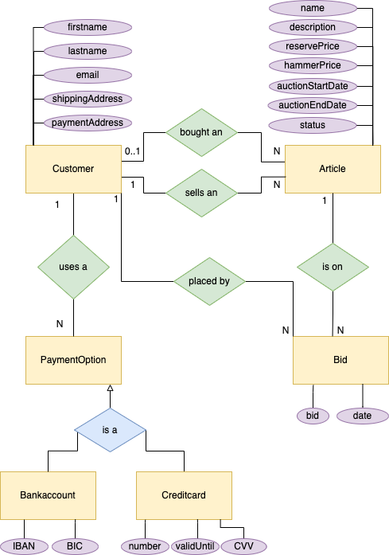

# Übung 2 - Auktionsbackend
Anna Voraberger | S2010307040
Aufwand: 13 h
Noch offen: ca. 5 h Arbeit, wird noch verlässlich nachgeholt.

Bin leider aus Zeitgründen noch nicht fertig geworden - mache die Aufgabe aber noch fertig und committe sie ins Github.
Status zum Zeitpunkt der Abgabe: DB-Struktur mit Mapping + Doku vorhanden. Article und Tests implementiert. Insight-Methoden und Signatur für die Tests angelegt.


# Domänenmodell | ER-Model
## ER Model



## Customer
- firstname
- lastname
- eMail
- shippingAddress
- paymentAddress
- paymentMethods → PaymentOption (ein Kunde kann mehrere Zahlungsmöglichkeiten hinterlegen) sold/bought Articles → Article

```java
@Entity
@Setter
@Getter
@NoArgsConstructor
public class Customer {

  @Id
  @GeneratedValue
  private Long id;

  private String firstname;

  private String lastname;

  private String eMail;

  @Embedded
  @AttributeOverride(name = "street", column = @Column(name = "payA_street"))
  @AttributeOverride(name = "houseNr", column = @Column(name = "payA_houseNr"))
  @AttributeOverride(name = "zipCode", column = @Column(name = "payA_zipCode"))
  @AttributeOverride(name = "town", column = @Column(name = "payA_town"))
  private Address paymentAddress;

  @Embedded
  @AttributeOverride(name = "street", column = @Column(name = "shipA_street"))
  @AttributeOverride(name = "houseNr", column = @Column(name = "shipA_houseNr"))
  @AttributeOverride(name = "zipCode", column = @Column(name = "shipA_zipCode"))
  @AttributeOverride(name = "town", column = @Column(name = "shipA_town"))
  private Address shippingAddress;

  @OneToMany(mappedBy = "owner", cascade = CascadeType.ALL, orphanRemoval = true)
  private Set<PaymentOption> paymentOptions = new HashSet<>();

  @OneToMany(mappedBy = "seller", cascade = {CascadeType.MERGE, CascadeType.PERSIST, CascadeType.REFRESH})
  private Set<Article> soldArticles = new HashSet<>();

  @OneToMany(mappedBy = "buyer", cascade = {CascadeType.MERGE, CascadeType.PERSIST, CascadeType.REFRESH})
  private Set<Article> boughtArticles = new HashSet<>();

  @OneToMany(mappedBy = "bidder", cascade = {CascadeType.MERGE, CascadeType.PERSIST, CascadeType.REFRESH})
  private Set<Bid> bids = new HashSet<>();

```
### Relationships
Der Customer hat sowohl eine eingebettete payment als auch shipping Address.
Diese Klasse ist auch die owner-Klasse für die Beziehungen zu den PaymentOptions, den bids, boughtArticles und den soldArticles, da es sich jeweils um 1:N Beziehungen handelt. In diesem Fall müssen auch die Adressspalten neu benannt werden, da diese bei den beiden Adressen sonst identisch wären, was nicht möglich ist.

Die Cascadetypes wurden so gewählt dass Articles nicht notwendigerweise abhängig vom Customer existieren, da immer 2 dranhängen. Gibt es den seller oder buyer nicht mehr, soll der Article nicht gelöscht werden - daher kein ```Cascade.REMOVE``` und kein Orphanremoval.

Bids sollen für Auswertungszwecke ebenfalls noch zur Verfügung stehen, falls es den Customer nicht mehr gibt, daher ebenfalls kein ```REMOVE```.

Zahlungsmethoden werden ohne Customer nicht mehr gebraucht, daher ```Cascade.ALL``` und ```orphanRemoval = true```.


## PaymentOption
Es gibt zwei Zahlungsarten: Bankkonten und Kreditkarten.
- owner (Name des Kredikarten/Konto-Besitzers)
- bankAccountNumber (IBAN)
- bankIdentifier (BIC)
- creditCardNumber
- creditCardValidTo
- cardVerificationValue (CVV)

### Inheritance
```PaymentOption``` als Klasse selbst beinhaltet die Id, den Namen auf der Zahlungsmethode und den Customer, der als Besitzer hinterlegt ist. Der Name wird hier nochmal gespeichert, da der Customer Name und der auf der Karte angegebene Name sich unterscheiden können. Die Klassen Bankaccount und Creditcard leiten davon ab und beinhalten die eigentlichen Zahlungsinformationen zum jeweiligen Zahlungsmittel.

Daher wird auch die Inheritance strategy ```JOINED``` verwendet, sodass jede Zahlungsmethode eine eigene Tabelle erhält, in der die Id als Foreign Key mitgespeichert wird. Da auf die Zahlungsmethode voraussichtlich immer über die Parentklasse zugegriffen wird, muss nicht jedesmal eine UNION gemacht werden, wie das bei ```TABLE_PER_CLASS```der Fall wäre. Die ```SINGLE_TABLE```Strategie würde sehr viele Einträge mit NULL mit sich bringen.

```java
@Entity
@Inheritance(strategy = InheritanceType.JOINED)
@Getter
@Setter
@NoArgsConstructor
public class PaymentOption {

  @Id
  @GeneratedValue
  private Long id;

  private String ownerName;

  @ManyToOne
  private Customer owner;
}
```

```java
@Entity
@Getter
@Setter
@NoArgsConstructor
public class Creditcard extends PaymentOption {

  private Long number;

  private Date validUntil;

  private int cvv;
}
```

```java
@Entity
@Getter
@Setter
@NoArgsConstructor
public class Bankaccount extends PaymentOption{

  private String owner;

  private Long IBAN;

  private String BIC;
}
```

Die Zahlungsmethoden eines Customers werden als Liste beim Customer geführt und als OneToMany-ManyToOne Beziehung modelliert.

## Article
- name
- description
- reservePrice (Ausrufungspreis, untere Preisgrenze)
- hammerPrice (finaler Preis, falls der Artikel erfolgreich versteigert wurde) auctionStartDate
- auctionEndDate
- seller → Customer
- buyer → Customer (falls erfolgreich versteigert)
- status
  - LISTED (erfasst, aber Auktion nicht gestartet)
  - AUCTION_RUNNING
  - SOLD (Auktion beendet, Artikel wurde versteigert)
  - NOT_SOLD (Auktion beendet, Artikel wurde nicht versteigert)

```java
@Entity
@NoArgsConstructor
@Getter
@Setter
public class Article {
  @Id
  @GeneratedValue
  private Long id;

  private String name;

  private String description;

  private Double reservePrice;

  private Double hammerPrice;

  private Date auctionStartDate;

  private Date auctionEndDate;

  @OneToMany(mappedBy = "article", cascade = CascadeType.REMOVE, orphanRemoval = true)
  private Set<Bid> bids = new HashSet<>();

  private ArticleStatus status;

  @ManyToOne
  private Customer buyer;

  @ManyToOne
  private Customer seller;
}

```
### Relationships
Die Beziehung zu den Bids habe ich als ```OneToMany``` Beziehung umgesetzt, da es sich um eine 1:N Beziehung handelt.

Den Cascade Type habe ich auf ```REMOVE``` gesetzt, damit beim Löschen eines Artikels auch dessen Bids gelöscht werden. Diese werden dann nicht mehr gebraucht.
Ich habe mich gegen ```Cascade.PERSIST``` bzw. ```Cascade.MERGE``` entschieden: Es beeinflusst Bids nicht, wenn Name, Preis o.Ä. beim Artikel verändert werden. Ist ein Bid einmal abgesetzt, muss daran nichts verändert werden.

### Article Status
Den Article Status habe ich als ```enum``` Type angelegt.


## Bid
- bid (gebotener Preis)
- date
- bidder → Customer
- article → Article (auf den sich das Gebot bezieht; je Artikel können mehrere Gebote abgegeben werden)

```java
@Entity
@Getter
@Setter
@NoArgsConstructor
public class Bid {

  @Id
  @GeneratedValue
  private Long id;

  private Double bid;

  private Date date;

  @ManyToOne
  private Article article;

  @ManyToOne
  private Customer bidder;
}
```

In der Bid sind nur noch die "non-owning" seiten der Beziehungen zu article und bidder zusätzlich zu den Bidding-Infos wie Preis und Datum angelegt.

## Korrektes Mapping
Durch die Annotationen wurde auch meinem ER Diagramm entsprechend gemappt.


# Data Access Layer
Auf dieser Ebene liegen alle DAOs, die die Artikel, Bids, Customers und PaymentOptions managen.

## TransactionsUtil
Die Transaktionslogik habe ich wie in der Übung herausfaktoriert und stelle im TransactionsUtil die Entitymanager Factory zur Verfügung bzw. mit dem EntityManager Task und EntityManagerTaskWithResult gleich die executes, die mit der Factory (die einmal anfangs erstellt wird) einen EntityManager erzeugen und den Task ausführen.

Code identisch zur Übung.

## CustomerManager

## PaymentOptionManager

## ArticleManager

```java
@NoArgsConstructor
public class ArticleManager {

  public Article getArticleById(Long id){
    if (id == null) return null;
    var result = TransactionsUtil.executeTaskWithResult(em ->{
      var query = em.createQuery("select a from Article a where id = :id",Article.class);
      query.setParameter("id",  id);
      return query.getSingleResult();
    });
    return result;
  }

  public List<Article> getArticles(){
    var result = TransactionsUtil.executeTaskWithResult(em ->{
      var query = em.createQuery("select a from Article a",Article.class);
      return query.getResultList();
    });
    return result;
  }

  public List<Article> getArticlesMaxReservePrice(Double maxReservePrice){
    if(maxReservePrice == null || maxReservePrice < 0){
      return new ArrayList<>();
    }
    var result = TransactionsUtil.executeTaskWithResult(em ->{
      var query = em.createQuery("select a from Article a where reservePrice <= :max",Article.class);
      query.setParameter("max",  maxReservePrice);
      return query.getResultList();
    });
    return result;
  }

  public List<Article> getArticlesMaxReservePriceInOrder(Double maxReservePrice, ArticleOrder order){
    final var max = (maxReservePrice != null && maxReservePrice > 0) ? maxReservePrice : Double.MAX_VALUE;
    switch (order) {
      case NAME: {
        var result = TransactionsUtil.executeTaskWithResult(em -> {
          var query = em.createQuery("select a from Article a where reservePrice <= :max order by name", Article.class);
          query.setParameter("max", max);
          return query.getResultList();
        });// Transaction end
        return result;
      }
      case HAMMER_PRICE: {
        var result = TransactionsUtil.executeTaskWithResult(em -> {
          var query = em.createQuery("select a from Article a where reservePrice <= :max order by hammerPrice desc", Article.class);
          query.setParameter("max", max);
          return query.getResultList();
        });// Transaction end
        return result;
      }
      case AUCTION_START_DATE: {
        var result = TransactionsUtil.executeTaskWithResult(em -> {
          var query = em.createQuery("select a from Article a where reservePrice <= :max order by auctionStartDate desc", Article.class);
          query.setParameter("max", max);
          return query.getResultList();
        });// Transaction end
        return result;
      }
      case RESERVE_PRICE: {
        var result = TransactionsUtil.executeTaskWithResult(em -> {
          var query = em.createQuery("select a from Article a where reservePrice <= :max order by reservePrice desc", Article.class);
          query.setParameter("max", max);
          return query.getResultList();
        });// Transaction end
        return result;
      }
    }
    var result = TransactionsUtil.executeTaskWithResult(em -> {
      var query = em.createQuery("select a from Article a where reservePrice <= :max", Article.class);
      query.setParameter("max", max);
      return query.getResultList();
    });// Transaction end
    return result;
  }

  public boolean insert(Article article){
    try {
      TransactionsUtil.execute(em -> {em.persist(article);});
      return true;
    } catch (Exception e) {
      e.printStackTrace();
      return false;
    }
  }

  public boolean update(Article article){
    if (article == null || getArticleById(article.getId()) == null){
      return false;
    }
    try {
      TransactionsUtil.execute(em -> {em.merge(article);});
      return true;
    } catch (Exception e) {
      e.printStackTrace();
      return false;
    }
  }

  public boolean delete(Article article){
    if (article == null || getArticleById(article.getId()) == null){
      return false;
    }
    try {
      TransactionsUtil.execute(em -> {em.remove(em.contains(article) ? article : em.merge(article));});
      return true;
    } catch (Exception e) {
      e.printStackTrace();
      return false;
    }

  }

}
```

### Tests


```java

public class ArticleManagerTest {

  static ArticleManager articleManager = new ArticleManager();

  @BeforeClass
  public static void init(){
    TransactionsUtil.getEntityManagerFactory();
  }


  @AfterClass
  public static void cleanup(){
    TransactionsUtil.closeEntityManagerFactory();
  }

  @Test
  public void getArticleById_returnsCorrectArticle(){

    Article article = articleManager.getArticleById((long)1);
    Assert.assertEquals(article.getId(), (long)1);
  }

  @Test
  public void getArticles_returnsAllArticles(){
    List<Article> articles = articleManager.getArticles();
    Assert.assertEquals(articles.size(), 6); //TODO

  }
  /*
  // Successful with empty DB
  @Test
  public void getArticles_EmptyDataBase_returnsEmptyList(){
    List<Article> articles = articleManager.getArticles();
    Assert.assertEquals(articles.size(), 0); //TODO
  }*/

  @Test
  public void getArticlesMaxReservePrice_returnsCorrectArticles() {
    List<Article> articles = articleManager.getArticlesMaxReservePrice(100.0);
    Assert.assertEquals(articles.size(), 3); //TODO
    Assert.assertTrue(articles.get(0).getReservePrice()<=100.0);
  }

  @Test
  public void getArticlesMaxReservePrice_MaxReservePriceZero_ReturnsEmptyList(){
    List<Article> articles = articleManager.getArticlesMaxReservePrice(0.0);
    Assert.assertEquals(articles.size(), 0);
  }

  @Test
  public void getArticlesMaxReservePrice_MaxReservePriceNull_ReturnsEmptyList(){
    List<Article> articles = articleManager.getArticlesMaxReservePrice(null);
    Assert.assertEquals(articles.size(), 0);
  }

  @Test
  public void getArticlesMaxReservePriceInOrder_NameOrder_ReturnsCorrectList(){
    List<Article> articles = articleManager.getArticlesMaxReservePriceInOrder(100.0, ArticleOrder.NAME);
    Assert.assertEquals(articles.get(0).getName(), "AName");
    Assert.assertEquals(articles.get(2).getName(), "ZName");
  }

  @Test
  public void getArticlesMaxReservePriceInOrder_ReservePriceOrder_ReturnsCorrectList(){
    List<Article> articles = articleManager.getArticlesMaxReservePriceInOrder(100.0, ArticleOrder.RESERVE_PRICE);
    Assert.assertEquals(articles.get(0).getReservePrice(), 100.0);
    Assert.assertEquals(articles.get(2).getReservePrice(), 58.0);
  }

  @Test
  public void getArticlesMaxReservePriceInOrder_HammerPrice_ReturnsCorrectList(){
    List<Article> articles = articleManager.getArticlesMaxReservePriceInOrder(100.0, ArticleOrder.HAMMER_PRICE);
    Assert.assertEquals(articles.get(0).getHammerPrice(), 900.2);
    Assert.assertEquals(articles.get(2).getHammerPrice(), 110.0);
  }

  @Test
  public void getArticlesMaxReservePriceInOrder_AuctionStartDate_ReturnsCorrectList(){
    List<Article> articles = articleManager.getArticlesMaxReservePriceInOrder(100.0, ArticleOrder.AUCTION_START_DATE);
    Assert.assertEquals(articles.get(0).getAuctionStartDate(), LocalDate.of(2022, 9,26));
    Assert.assertEquals(articles.get(2).getAuctionStartDate(), LocalDate.of(2019,4,26));
  }

  @Test
  public void getArticlesMaxReservePriceInOrder_MaxReservePriceZeroOrNull_ReturnsFullOrderedList(){
    List<Article> articles_1 = articleManager.getArticlesMaxReservePriceInOrder(0.0, ArticleOrder.NAME);
    List<Article> articles_2 = articleManager.getArticlesMaxReservePriceInOrder(null, ArticleOrder.NAME);
    Assert.assertEquals(articles_1.get(0).getName(), "AName");
    Assert.assertEquals(articles_2.get(0).getName(), "AName");
  }

  @Test
  public void insert_correctArticle_ReturnsTrue(){
    Article article = new Article();
    Long id = article.getId();
    article.setName("name");
    article.setAuctionStartDate( LocalDate.of(2023,01,01));
    article.setReservePrice(50.0);
    article.setDescription("description");

    Assert.assertTrue(articleManager.insert(article));
    articleManager.delete(article);
  }

  @Test
  public void insert_null_ReturnsFalse(){
    Assert.assertFalse(articleManager.insert(null));
  }

  @Test
  public void insert_alreadyExistingArticle_ReturnsFalse(){
    Assert.assertFalse(articleManager.insert(null));
  }

  @Test
  public void update_correctArticle_UpdatesArticleAndReturnsTrue(){
    Article article = articleManager.getArticleById((long)1);
    String oldName = article.getName();
    article.setName("theNewName");

    Assert.assertTrue(articleManager.update(article));

    Assert.assertEquals(articleManager.getArticleById((long)1).getName(), "theNewName");
    Assert.assertNotEquals(articleManager.getArticleById((long)1).getName(), oldName);

    article.setName(oldName);
    articleManager.update(article);
    Assert.assertEquals(articleManager.getArticleById((long)1).getName(), oldName);
  }

  @Test
  public void update_null_ReturnsFalse(){
    Assert.assertFalse(articleManager.update(null));
  }

  @Test
  public void update_ArticleDoesNotExist_ReturnsFalse(){
    Article article = new Article();
    Assert.assertFalse(articleManager.update(article));
  }

  @Test
  public void delete_validArticle_ReturnsTrueAndDeletesArticle(){
    Article article = articleManager.getArticleById((long)1);
    Assert.assertTrue(articleManager.delete(article));
    articleManager.insert(article);
  }

  @Test
  public void delete_ArticleDoesNotExist_ReturnsFalse(){
    Article article = new Article();
    Assert.assertFalse(articleManager.delete(article));
  } 


  }

```

## BidManager

## Data Access Layer | Integration Tests

# Insights

## InsightsTests
